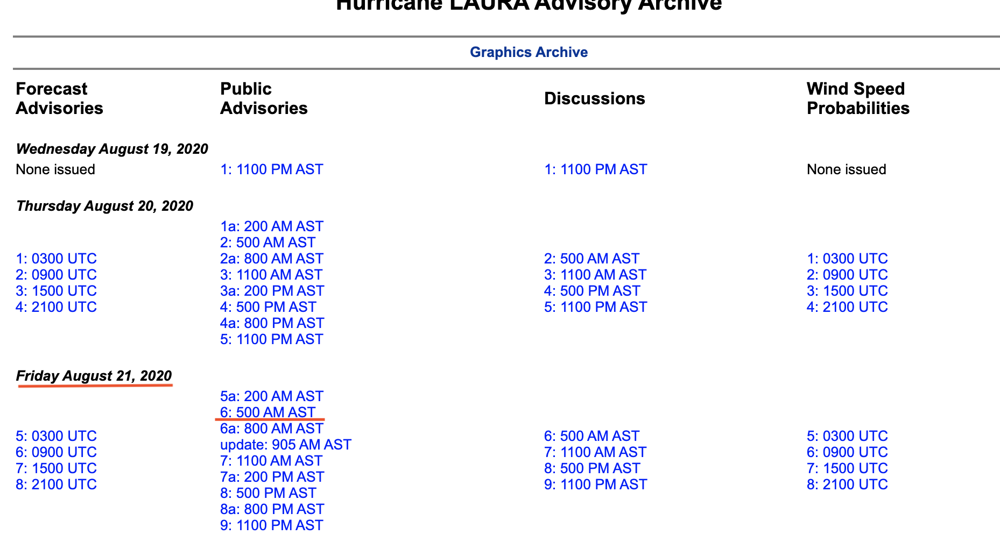
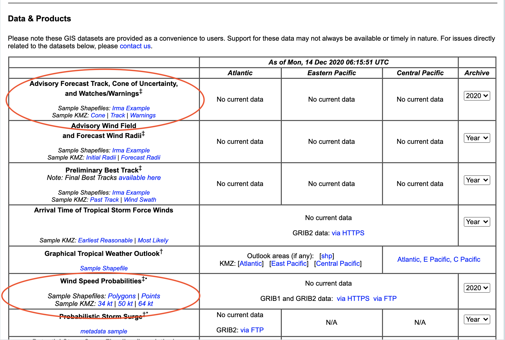
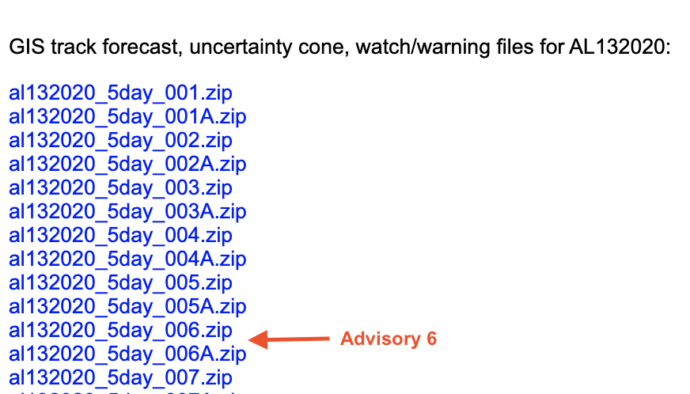
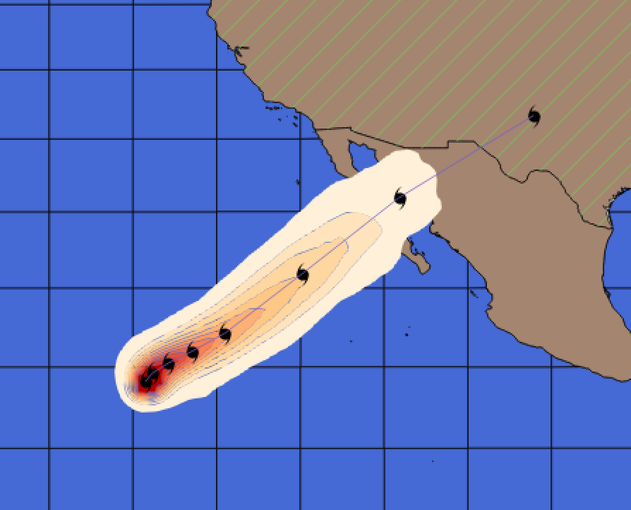

# Lab: Hurricane Map
## Assignment

## Deliverable
- `screencap_hurricane.png`

### Overview
Create a hurricane map with symbolized wind speed probabilities for a historic (or current) hurricane.

### Download Source Data
The National Hurricane Center monitors the Atlantic and Pacific basins for signs of tropical storm development and, when tropical storms develop, name and track them. When they become a tropical storm they begin issuing advisories every 6 hours until the storm has been downgraded and is no longer perceived as a tropical storm threat. The 6-hr advisories are typically released with shapefiles and kml files showing the projected path, the cone of uncertainty, and the historic path to-date. This goes along with a daily product of wind speed probabilities, a polygon product that provide the forecasted probabilities of 34-, 50-, and 64-knot sustained winds to help assess wind risk of potentially affected areas.

Your job is to combine the projected path (both line and cone of uncertainty, the historic path, and the wind speed probabilities into a map product. Examples are included from past Hurricane Laura. The process for obtaining the data is:

1) From the [Tropical Cyclone Advisory Archive](https://www.nhc.noaa.gov/archive/2021/), find Hurricane Ida (in the Atlantic).
2) Select an advisory from before landfall (August 29, 2021):
  - Click on the storm to see its Advisory Archive and:
  - Use the "Graphics Archive" to select a particular advisory. Take note of the advisory number and the date.
  - Take note of the date and specific advisory (e.g., `6` and `6a` are different.

3) Download the GIS Products (At `Analyses and Forecasts`->`GIS Products`, or at https://www.nhc.noaa.gov/gis/).
  - You will need to know the date and the advisory number and find the appropriate zip files for the following two sections:
  . More details follow:
  
  - **Advisory Forecast Track, Cone of Uncertainty, and Watches/Warnings‡** Select the appropriate year at right. This produces a list of links to zip files of each of the advisories. An example advisory might look like this: `al132020_5day_006.zip` with the last three digits representing the advisory number (e.g., `006` in this example). Download and unzip the file file to reveal 4 shapefiles. You will use the point (`pts`), line (`lin`), and polygon (`pgn`) shapefiles.
  
 
 - **Wind Speed Probabilities** Select the appropriate year at right. This gives a full list of wind speed probabilities for the whole year so hone in on the date you need to match the advisory and download the zip file. Download and extract the zip file. You will see files assoihated with 3 shapefiles for the 34-kt, 50-kt and 64-kt wind speed probabilities. You will only use the 64-kt wind speed probability, which will be named something like `2020082500_wsp64knt120hr_5km`where the first 10 characters are date/time in the form of `YYYYMMDDHH`, then the second part is `wsp64kt`to indicate 64-knot forecast and the final part is the forecast period (`120 hr`) and spatial resolution (`5km`).
 
  
Ancilliary data for this project is available in this repository on `D2L`. When you unzip the `data.zip` file you will find spatial data related to political boundaries and oceans.

- US States - `data/states/cb_2017_us_state_5m.shp`
- World Countries - `data/countries/ne_50m_admin_0_countries.shp`
- World Oceans - `data/water/simplified-water-polygons-complete-3857.shp`
_update_ - World Oceans can be downloaded from https://osmdata.openstreetmap.de/data/water-polygons.html

## Assignment

### 0. Checkout this assignment and create a new branch named `assignment`.
Perform all your work in the `assignment` branch. When you have completed the assignment, submit a `Pull request` to merge `assignment` -> `master`.

### 1. Create a forecast map in QGIS of your hurricane
Using QGIS, make a map with the following symbologies:

This map should use the following:

- Simple Fill Solid (countries)
- Simple Fill Hatched (US States)
- Categorized (wind speed probabilities) with a color ramp
- Custom SVG for Hurricane Forecast Location (download from https://upload.wikimedia.org/wikipedia/commons/e/e3/Hurricane_north.svg)

Take a screenshot of your final product and name it `screencap_hurricane.png`

## Deliverable
Pull request to merge `assignment` branch to `master` containing the following file:
- `screencap_hurricane.png`
